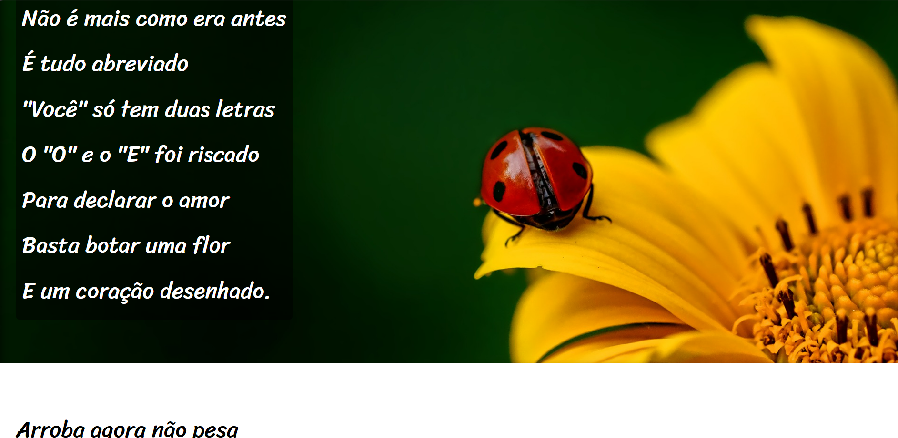

# 🌾 **Projeto Cordel** 🌾

"Entre versos e linhas, um treino que virou poesia em código."

📖 Sobre o projeto

Este projeto foi desenvolvido durante meus estudos de HTML e CSS, com o objetivo de praticar e aprofundar conhecimentos nessas linguagens fundamentais para a web.

O Projeto Cordel traz para a tela um poema de Milton Duarte, transformando texto em uma experiência visual inspirada no estilo dos tradicionais folhetos de cordel.

🔗 [**Acesse o site aqui**](https://brenojramos.github.io/Projeto-Cordel/)

🛠️ Tecnologias utilizadas

HTML5 → Estrutura da página

CSS3 → Estilização e responsividade

🎯 Objetivos de aprendizagem

Praticar marcação semântica em HTML

Trabalhar posicionamento e estilos com CSS

Experimentar com layout responsivo

Exercitar a criatividade trazendo um tema cultural

✨ Resultado

O site apresenta o poema em formato simples e elegante, mantendo o espírito do cordel: direto, artístico e cheio de personalidade.

  

